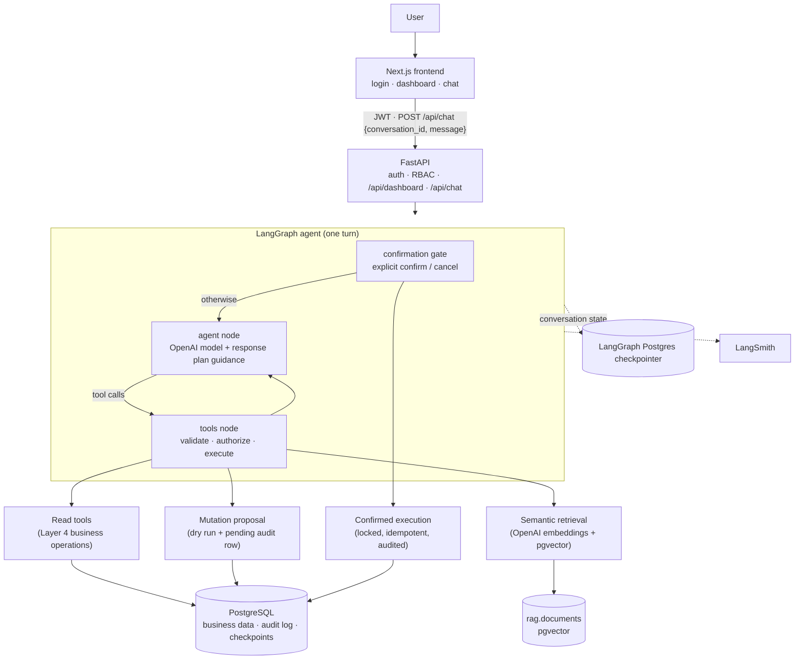

# Business Management System

A role-aware conversational assistant for inventory and procurement. Staff sign in, see a
dashboard for their role, and ask questions in plain language ("Which items are low on stock?",
"Compare spend by vendor"). The assistant answers from the live business database through a
fixed set of authorized tools, shows tables, metrics and charts where they help, and can
**propose** a stock movement or a purchase order. A proposal changes nothing until the user
explicitly confirms it.

The model never sees credentials, never writes SQL and never decides who may do what: identity,
permissions, validation and every database change are enforced by ordinary server code.

## Contents

- [Architecture](#architecture)
- [Roles and permissions](#roles-and-permissions)
- [Authentication](#authentication)
- [AI architecture](#ai-architecture)
- [Mutation safety](#mutation-safety)
- [Tables, metrics and charts](#tables-metrics-and-charts)
- [Observability (LangSmith)](#observability-langsmith)
- [Testing](#testing)
- [Running locally](#running-locally)
- [Environment variables](#environment-variables)
- [Demo flow](#demo-flow)
- [Limitations and out of scope](#limitations-and-out-of-scope)

## Architecture



| Part | Technology | Location |
| --- | --- | --- |
| Frontend | Next.js 16 (App Router), React 19, TypeScript (strict); no UI/chart libraries | `frontend/` |
| API | FastAPI, Pydantic settings | `backend/app/api`, `backend/app/config.py` |
| Auth & RBAC | bcrypt, JWT (HS256) | `backend/app/auth` |
| Business operations | SQLAlchemy Core + psycopg 3, no ORM | `backend/app/services`, `backend/app/db` |
| Agent | LangGraph, `langchain-openai` (`AGENT_MODEL`, e.g. `gpt-5.4-mini`) | `backend/app/agent` |
| Retrieval | OpenAI `text-embedding-3-small`, pgvector | `backend/app/rag` |
| Tracing | LangSmith (optional) | `backend/app/observability.py` |

The database schema belongs to the existing business system; the application never creates or
alters business tables. `schema_dump.sql` is a schema-only reference of the public schema.

## Roles and permissions

Permissions are defined once (`backend/app/auth/permissions.py`) and checked by the business
operations themselves, so they hold no matter how an operation is reached (dashboard, agent tool,
confirmation).

| Role | Permissions | Can read | Can change (via confirmed proposal) |
| --- | --- | --- | --- |
| Inventory manager | `inventory:read`, `inventory:write` | items, stock by location, transactions, low stock, locations, catalogue knowledge | stock movements (inbound / outbound) |
| Procurement manager | `inventory:read`, `procurement:read`, `procurement:write` | everything above, plus vendors and purchase orders | new purchase orders |
| Owner | `inventory:read`, `procurement:read`, `analytics:read` | everything above, plus business-wide inventory and procurement summaries | nothing (read-only) |

The dashboard (`GET /api/dashboard`) includes only the sections the caller's permissions allow:
inventory counts for everyone, vendor and purchase-order figures for procurement managers and
owners, and the analytics breakdowns for owners. The chat agent is only offered the tools the
role may use, and the server re-checks the permission for every call.

## Authentication

- `POST /api/auth/login` checks the email and password (bcrypt) and returns a signed JWT
  (HS256, `ACCESS_TOKEN_EXPIRE_MINUTES`, default 30). The token holds only the user id, a token
  version and the expiry. Failures are generic, and an unknown email still costs a bcrypt check.
- Every protected request reloads the user from the database: inactive users and tokens whose
  version no longer matches are rejected, and the **role always comes from the database**, never
  from the token or the request body.
- The frontend keeps only the token and its expiry in `sessionStorage` (per tab, never
  `localStorage`). Any 401 ends the session and returns to the sign-in page. Signing out clears the
  tab's session; there is no server-side logout or refresh-token flow (the token simply expires).

## AI architecture

**The graph.** Each user message is one LangGraph turn (`backend/app/agent/graph.py`):

1. **Confirmation gate.** If the message is an explicit "confirm" or "cancel" answering the
   proposal made just before it, Layer 8 executes or cancels that proposal and the turn ends
   without a model call.
2. **Agent node.** The OpenAI model gets a role-specific system prompt, the conversation so far,
   and short guidance from the response planner. It answers, or calls tools.
3. **Tools node.** Each tool call is executed by the server-side executor, and the results go back
   to the model. The loop is bounded by `AGENT_MAX_ITERATIONS`.

**Controlled tools.** The model can only call tools from an explicit registry
(`backend/app/agent/tools.py`); there is no free-form SQL. Arguments are validated against strict
schemas (unknown fields rejected, no coercion), the authenticated user is supplied by the server
(the model cannot pass a user, role or SQL), and errors come back as short, safe messages.

| Group | Tools |
| --- | --- |
| Inventory (read) | `search_items`, `get_item_details`, `get_stock_by_location`, `get_transaction_history`, `get_low_stock_items`, `list_locations` |
| Procurement (read) | `list_vendors`, `get_vendor`, `list_purchase_orders`, `get_purchase_order`, `procurement_overview` |
| Analytics (owner) | `inventory_summary`, `procurement_summary` |
| Knowledge | `search_knowledge` (semantic retrieval) |
| Changes (proposals only) | `record_stock_movement`, `create_purchase_order`, `record_purchase_receipt` |

**Mistyped references.** Item codes, PO numbers and location names are matched exactly, then
ignoring case, spacing and punctuation, but only when exactly one record matches. Otherwise the
tool fails with up to three close matches, and the agent asks "Did you mean …?" instead of
choosing. A guessed record is never used for a change (`backend/app/services/matching.py`).

**Structured retrieval vs. semantic retrieval.** Live facts (stock quantities, prices, purchase
orders, vendors, transactions) always come from the structured tools above. Semantic retrieval
(`backend/app/rag`) covers only descriptive catalogue text — item and classification
descriptions — embedded with OpenAI and searched with pgvector, with a similarity threshold
(`RAG_SIMILARITY_THRESHOLD`). Live quantities, prices, users, audit data and conversations are
never put into the vector index.

**Response planning.** A deterministic, rule-based planner (`backend/app/agent/planning.py`,
no model call) classifies each turn as informational, analytical, knowledge, mixed, operational,
conversational or unclear, picks the source (structured tools, semantic retrieval, both, none, or
ask for clarification) and the presentation (text, table, summary or chart). Its guidance is
given to the model at the start of a turn, and its final plan is returned with the reply.

**Conversation state.** Messages are stored by LangGraph's PostgreSQL checkpointer. The thread
key is derived from the authenticated user plus the client's conversation UUID, so two users
sending the same conversation id get separate threads. The client sends only
`{conversation_id, message}`. Follow-up questions work because the checkpointer supplies the
earlier turns. The browser keeps the visible conversation in memory only: it survives moving
between dashboard and chat, and a reload starts a new conversation.

## Mutation safety

A tool call can never change data by itself (`backend/app/agent/mutations.py`):

```text
model proposes a change (tool call)
  → strict argument validation
  → permission check for the authenticated user
  → dry run: the real business operation runs in a transaction that is always rolled back,
    producing the preview (e.g. stock 10 → 12, PO totals)
  → pending request stored in agent_audit_log (user, conversation, arguments, preview)
  → confirmation message written by the server, not the model ("Nothing has been changed yet")
  → user replies "confirm" (or presses Confirm)        or "cancel" (nothing happens)
  → execution: the request is row-locked, the permission is re-checked, the operation runs
    once and the request is marked executed, all in one transaction
  → audit: the business operation's own audit row plus the request's final state
```

Guarantees, each covered by tests:

- **Explicit confirmation only.** Only the user's own next message, and only a plain
  confirm/cancel ("yes", "confirm", "go ahead", "cancel", …), answers a proposal. Anything else
  leaves it unconfirmed, and the model cannot confirm by calling the tool again.
- **Scoped.** A proposal belongs to one user and one conversation; one change per turn, and a new
  proposal supersedes an unconfirmed one.
- **Expiry.** Proposals expire after 30 minutes.
- **Idempotent and race-safe.** Repeated or concurrent confirmations execute once; a confirmation
  racing a cancellation resolves to exactly one outcome.
- **Owner cannot change data**, even if the model attempts a change tool.
- **Audit states:** pending, success, and failed — with the outcome (failed, denied, cancelled,
  superseded, expired) recorded on the request.

## Tables, metrics and charts

The backend decides what can be visualized; the frontend only renders it. With each reply,
`POST /api/chat` returns:

```text
{ conversation_id, message, plan, mutation, data: { datasets: [...], metrics: [...] } }
```

Each dataset carries `tool, title, kind, x, y, series, chart, columns, rows, total_rows,
truncated`. Rows are copied from the same tool results the agent used in that turn (no second
query), through an explicit per-dataset column allowlist (`backend/app/agent/datasets.py`):

- No ids, user references, notes, nested objects, tool arguments or tool-call ids are sent.
- At most 50 rows per dataset, 6 datasets per reply, 200 characters per text cell; `total_rows`
  and `truncated` report when more existed.
- Money stays an exact decimal next to its currency; amounts in different currencies are never
  added together.
- A reply that proposes or executes a change never carries data.

The frontend (`frontend/src/lib/visualize.ts`, `src/components/chat/data`) shows tables, metric
strips, **bar** charts (HTML/CSS) and **line** charts (inline SVG) without a chart library. Each
chart has a one-sentence description for assistive technology, and a dataset that cannot be drawn
faithfully (for example negative values, or too many series) is shown as a table instead.

Charts do not need to be asked for. The planner charts a dataset when the question compares or
ranks (bar) or follows something over time (line) and the returned rows can show exactly that:
the dataset matches the question's subject, its values vary, and it has at most 20 bars. Detail
lookups and single figures stay tables or text. An explicit request for a chart is honoured
whenever the data supports one.

## Observability (LangSmith)

Tracing is **optional and off by default** (`LANGSMITH_TRACING=false`). When enabled, each chat
turn appears in LangSmith as:

```text
LangGraph → confirmation / agent / tools nodes → ChatOpenAI calls (with token usage)
          → tool span (e.g. get_low_stock_items) → semantic_retrieval span
```

It is **privacy-first** (`backend/app/observability.py`):

- Every run's **inputs and outputs are hidden**: no user messages, prompts, tool arguments,
  tool results, database rows, mutation payloads or documents are sent.
- Metadata is reduced to an allowlist: graph node names, model name and token usage, the user's
  role, and the safe facts the custom spans add — tool name, outcome (success / error /
  proposed) and error kind; for retrieval the source filter, `top_k`, result count and
  similarity range. The conversation thread id (which contains the user id) is dropped.
- A failing span records only the exception type, never its message or traceback.
- Only the backend settings decide: if they say off, nothing is traced even when LangSmith
  variables are set in the shell. Uploads run in the background, so an unreachable LangSmith
  never fails or slows a request.

## Testing

| Suite | Command (from the folder shown) | Notes |
| --- | --- | --- |
| Backend, full | `backend$ .venv/bin/python -m pytest` | 747 passed, 6 skipped (opt-in live tests); about 4–5 minutes, mostly the remote database |
| Backend, offline | `backend$ .venv/bin/python -m pytest -m "not db"` | about 4 seconds; no database, no network |
| Backend, database only | `backend$ .venv/bin/python -m pytest -m db` | needs `DATABASE_URL` |
| Frontend | `frontend$ npm test` | 134 tests, Node's built-in test runner |
| Frontend checks | `frontend$ npm run typecheck`, `npm run lint`, `npm run build` | |

- **Coverage.** RBAC and authorization boundaries, tool argument validation, cross-user
  conversation isolation, the full mutation lifecycle (dry run, confirmation, expiry, idempotency,
  confirm/cancel races, owner denial), the dataset data boundary, safe error mapping, RAG
  indexing and search, response planning, tracing redaction, and the frontend's API, session,
  chat-state and visualization logic. The model is scripted in tests; no test calls OpenAI unless
  explicitly enabled.
- **Database safety.** Database tests run inside transactions that are always rolled back; the few
  concurrency tests that must commit touch only their own audit rows and delete them. A session
  fixture fingerprints the schema, every table's row count, the content of the writable tables and
  the RAG index before and after the run, and fails the run if anything changed. In an offline
  run the database is blocked instead: any connection attempt fails the run.
- **Opt-in live tests** (skipped by default):
  - `AGENT_LIVE_OPENAI=1` — a few real OpenAI calls.
  - `AGENT_LIVE_CHECKPOINT=1` — writes one temporary thread to the real checkpoint tables, then
    deletes it.
  - `LIVE_LOGIN_EMAIL` / `LIVE_LOGIN_PASSWORD` — one real login.
  - `LANGSMITH_LIVE=1` (with LangSmith configured in `backend/.env`) — sends one redacted trace
    and reads it back.
- There are no browser end-to-end tests; the frontend tests cover logic and state, not rendering.

## Running locally

Prerequisites: Python 3.11, Node.js 20.9 or newer (verified with Node 25), and access to the
existing PostgreSQL database with pgvector. Demo account credentials are provided by the
operator; the project contains no passwords and no user-seeding script.

**Backend** (always uses `backend/.venv`; the root `venv/` is not used):

```bash
cd backend
python3.11 -m venv .venv                  # first time only
.venv/bin/pip install -r requirements.txt # first time only
cp .env.example .env                      # first time only; then fill in the values
.venv/bin/uvicorn app.main:app --port 8000   # add --reload while developing
```

Check it: `curl http://localhost:8000/api/health` and `curl http://localhost:8000/api/health/db`.

**Frontend** (in a second terminal):

```bash
cd frontend
npm ci                            # first time only
cp .env.example .env.local        # first time only; points at http://localhost:8000
npm run dev                       # development server on http://localhost:3000
# or: npm run build && npm run start
```

Open http://localhost:3000 and sign in.

**Database prerequisites** (already in place for the existing database; nothing here runs automatically):

- The agent stores conversations in the existing LangGraph checkpoint tables. It is created on the
  first chat request and refuses to start (chat returns 503) unless those tables are at the
  expected migration version; it never runs checkpoint setup itself.
- The semantic index lives in `rag.documents`, which is not part of `schema_dump.sql`. It is
  created and filled only on demand, with OpenAI embedding calls:
  `.venv/bin/python -m app.rag.index --create-schema` (first time), then
  `.venv/bin/python -m app.rag.index` to re-embed only new or changed records.

## Environment variables

**`backend/.env`** (template: `backend/.env.example`; never commit the real file)

| Variable | Required | Purpose |
| --- | --- | --- |
| `APP_NAME`, `APP_ENV`, `LOG_LEVEL` | no | name, environment label, log level |
| `CORS_ORIGINS` | no | comma-separated frontend origins (default `http://localhost:3000`) |
| `DATABASE_URL` | yes | PostgreSQL connection URL |
| `JWT_SECRET_KEY` | yes | token signing secret, at least 32 characters |
| `ACCESS_TOKEN_EXPIRE_MINUTES` | no | token lifetime (default 30) |
| `OPENAI_API_KEY` | for chat and search | OpenAI key (backend only) |
| `AGENT_MODEL` | for chat | a tool-calling OpenAI model, e.g. `gpt-5.4-mini` |
| `AGENT_MAX_ITERATIONS` | no | model calls per message (default 12, 1–50) |
| `EMBEDDING_MODEL` | for search | e.g. `text-embedding-3-small` |
| `RAG_SIMILARITY_THRESHOLD` | no | minimum similarity, 0–1 (default 0.3) |
| `LANGSMITH_TRACING` | no | `true` to enable tracing (default `false`) |
| `LANGSMITH_API_KEY` | when tracing | LangSmith key (backend only) |
| `LANGSMITH_PROJECT` | no | LangSmith project (default `lecxe-chatbot`) |

Without `OPENAI_API_KEY` / `AGENT_MODEL`, sign-in and the dashboard still work; chat requests
fail with 503 and the chat shows "The assistant is temporarily unavailable".

**`frontend/.env.local`** (template: `frontend/.env.example`)

| Variable | Purpose |
| --- | --- |
| `NEXT_PUBLIC_API_BASE_URL` | backend URL (default `http://localhost:8000`); public, never a secret |

## Demo flow

> **Warning: confirming a proposed change performs a real database write** — a real stock
> movement or a real purchase order with a new PO number — in the connected database. For a
> safe demo, show the proposal and press **Cancel**. Confirm only when a real change is
> intentionally being demonstrated.

1. **Sign in** as the inventory manager (credentials from the operator). The dashboard shows
   inventory counts only.
2. **Chat → inventory question:** "Show me low-stock items" — the answer comes with a table built
   from the tool result.
3. **Follow-up:** "Which locations hold inventory?", then ask about one of them (for example "show
   the stock at that location"). The assistant uses the earlier turns of the conversation.
4. **Knowledge question:** "What is a chequered plate?" — answered from semantic retrieval, as text.
5. **Propose a change:** "Add 2 units of <item code> at <location>". The reply is a confirmation
   card built by the server with the before/after stock; nothing has changed yet. Press
   **Cancel** (safe) — or **Confirm** only to demonstrate a real write. The result card then shows
   the change made; typing "confirm" again only reports that it was already made.
6. **Sign out, sign in as the owner.** The dashboard adds procurement and analytics sections.
7. **Analytical question:** "Give me an inventory summary" (metric strip and stock by location),
   then "Compare spend by vendor in a chart" (bar chart, kept separate per currency).
8. **Owner cannot change data:** ask the owner to add stock. The owner is offered no change tools
   and the server refuses them anyway, so no proposal is created.
9. **Optional — trace:** with LangSmith enabled, open the project to show the turn's structure
   (nodes, model calls with tokens, tool and retrieval spans) without any message or data content.

The procurement manager can demonstrate the same flow for purchase orders ("Show open purchase
orders", then propose an order to an active vendor and cancel it).

## Limitations and out of scope

- **No streaming:** each reply arrives when the turn is complete.
- **No refresh tokens or server-side logout:** a token is valid until it expires (default 30 minutes).
- **Low stock uses a fallback threshold:** `min_stock_level` is not set in the current data, so
  "low stock" currently means a quantity of zero or less.
- **Charts are bar and line only;** other data is shown as a table.
- **The browser does not keep or list past conversations;** a reload starts a new one.
- **Single API process:** turns in the same conversation are serialized with an in-process lock;
  running several API processes would need a shared lock.
- **Rule-based planning:** it chooses presentation and source heuristically; the model still writes the answer.
- **Not deployed;** there are no deployment scripts, and no browser end-to-end tests.
- **The live LangSmith check needs a key:** tracing is covered by offline tests; one real trace
  can be sent with `LANGSMITH_LIVE=1` once a key is configured.
- **Changes through chat are limited** to recording a stock movement and creating a purchase order.
